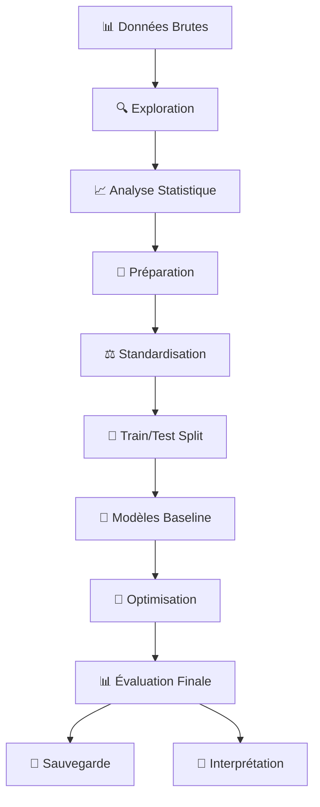

# 🏥 Pipeline ML Professionnel : Prédiction des Maladies Cardiaques

## 📋 Vue d'ensemble

Ce projet implémente un **pipeline ML complet et professionnel** pour la prédiction des maladies cardiaques, en suivant les meilleures pratiques de l'industrie et les standards académiques.

## 🎯 Objectifs d'apprentissage

### Compétences techniques maîtrisées :
- 📊 **Exploration avancée** : Analyse statistique, détection d'anomalies, corrélations
- 🧹 **Preprocessing rigoureux** : Imputation, encodage, standardisation avec prévention du data leakage
- 🎯 **Séparation stratifiée** : Maintien des distributions train/test
- 🤖 **Modélisation complète** : Baseline → Optimisation → Validation croisée
- 📈 **Évaluation multicritères** : Accuracy, Precision, Recall, F1, AUC
- 🧠 **Interprétation métier** : Importance des features, recommandations cliniques

### Compétences méthodologiques :
- ⚙️ **Pipeline ML standard** : Workflow reproductible et documenté
- 🔒 **Prévention du data leakage** : fit_transform sur train, transform sur test
- 📊 **Validation croisée** : StratifiedKFold pour évaluation robuste
- 🔧 **Optimisation systématique** : GridSearchCV avec espaces de paramètres logiques
- 📋 **Traçabilité complète** : Métadonnées, versioning, reproductibilité

## 🏗️ Architecture du pipeline



## 📚 Bibliothèques et composants

### Manipulation et visualisation
```python
# Data manipulation
import pandas as pd      # DataFrames, manipulation de données tabulaires
import numpy as np       # Calculs numériques, opérations vectorielles

# Visualisation
import matplotlib.pyplot as plt  # Graphiques de base, personnalisation
import seaborn as sns          # Graphiques statistiques avancés
```

### Machine Learning - Scikit-learn
```python
# Preprocessing
from sklearn.preprocessing import (
    StandardScaler,        # Standardisation (mean=0, std=1)
    LabelEncoder,         # Encodage variables catégorielles
    PolynomialFeatures     # Feature engineering polynomial
)

# Model selection et validation
from sklearn.model_selection import (
    train_test_split,      # Séparation train/test
    GridSearchCV,         # Optimisation exhaustive
    RandomizedSearchCV,   # Optimisation aléatoire
    StratifiedKFold,      # Validation croisée stratifiée
    cross_val_score        # Évaluation par validation croisée
)

# Modèles linéaires
from sklearn.linear_model import (
    LinearRegression,      # Régression linéaire simple
    LogisticRegression,    # Classification linéaire
    Ridge,               # Régression avec régularisation L2
    Lasso,               # Régression avec régularisation L1
    ElasticNet           # Régression avec régularisation mixte
)

# Modèles ensemble
from sklearn.ensemble import (
    RandomForestClassifier,     # Forêt d'arbres décisionnels
    GradientBoostingClassifier  # Boosting séquentiel
)

# Modèles non-linéaires
from sklearn.svm import SVC, SVR              # Machines à vecteurs de support
from sklearn.neighbors import KNeighborsClassifier # Plus proches voisins

# Clustering (non supervisé)
from sklearn.cluster import (
    KMeans,                 # Centroides mobiles
    DBSCAN,                 # Density-based clustering
    AgglomerativeClustering   # Clustering hiérarchique
)

# Réduction de dimensionnalité
from sklearn.decomposition import PCA  # Analyse en composantes principales

# Métriques d'évaluation
from sklearn.metrics import (
    accuracy_score,        # Exactitude des prédictions
    classification_report,  # Rapport détaillé de classification
    confusion_matrix,      # Matrice de confusion
    roc_auc_score,        # Aire sous la courbe ROC
    mean_squared_error,    # Erreur quadratique moyenne
    r2_score,             # Coefficient de détermination
    silhouette_score,      # Qualité du clustering
    precision_score,       # Précision des prédictions positives
    recall_score,          # Rappel des prédictions positives
    f1_score,             # Moyenne harmonique précision/rappel
    roc_curve             # Courbe ROC
)
```

## 🔄 Pipeline ML Standard

### 1. Exploration des données 🔍
- **Statistiques descriptives** : Moyenne, médiane, écart-type, quartiles
- **Visualisations** : Histogrammes, boxplots, scatter plots, heatmaps
- **Détection d'anomalies** : Outliers, valeurs manquantes, distributions anormales
- **Analyse de corrélations** : Matrice de corrélation, identification des multicollinéarités

### 2. Préparation des données 🧹
- **Imputation** : Stratégie adaptée par type (médiane pour numériques, mode pour catégorielles)
- **Encodage** : LabelEncoder pour variables ordinales, OneHot pour nominales
- **Standardisation** : StandardScaler avec prévention du data leakage
- **Feature engineering** : Création de variables dérivées, transformations polynomiales

### 3. Séparation train/test 📂
- **Stratification** : Maintien des proportions de classes
- **Répartition équilibrée** : 80% train, 20% test (ou autre selon contexte)
- **Validation hold-out** : Test set jamais utilisé avant évaluation finale

### 4. Modélisation 🤖
- **Baseline simple** : Régression logistique comme référence
- **Modèles ensemble** : Random Forest, Gradient Boosting
- **Modèles non-linéaires** : SVM avec noyaux RBF, KNN
- **Évaluation progressive** : Du plus simple au plus complexe

### 5. Optimisation 🔧
- **GridSearchCV** : Pour espaces de paramètres réduis
- **RandomizedSearchCV** : Pour espaces de paramètres larges
- **Validation croisée** : StratifiedKFold (généralement 5-fold)
- **Métrique d'optimisation** : Accuracy pour classes équilibrées, Recall/F1 pour déséquilibre

### 6. Évaluation finale 📊
- **Métriques multiples** : Accuracy, Precision, Recall, F1, AUC
- **Analyse d'erreurs** : Matrice de confusion, faux positifs/négatifs
- **Courbes ROC** : Analyse des seuils de décision
- **Importance des features** : Interprétabilité du modèle

## ⚠️ Règle d'or : Prévention du Data Leakage

### Data Leakage : Définition et dangers
Le **data leakage** se produit lorsque des informations du test set "fuient" vers le train set, entraînant une surestimation irréaliste des performances.

### Stratégie de prévention :
```python
# ❌ FAUX - Data leakage !
scaler = StandardScaler()
X_train_scaled = scaler.fit_transform(X_train)  # OK
X_test_scaled = scaler.fit_transform(X_test)   # ❌ Leakage !

# ✅ CORRECT - Prévention du leakage
scaler = StandardScaler()
X_train_scaled = scaler.fit_transform(X_train)  # fit + transform sur train
X_test_scaled = scaler.transform(X_test)        # transform SEULEMENT sur test
```

### Autres sources de leakage à éviter :
- Imputation avec statistiques globales avant split
- Feature engineering utilisant des informations futures
- Normalisation sur l'ensemble du dataset
- Sélection de features utilisant le target

## 🎯 Stratégie d'évaluation selon le contexte métier

### Contexte médical : Impacts des erreurs
- **Faux Négatif (FN)** : Patient malade non détecté = **DANGER VITAL**
- **Faux Positif (FP)** : Patient sain détecté comme malade = **Examens complémentaires**

### Choix des métriques :
```python
# Si détection précoce critique (priorité aux malades)
metric = 'recall'  # Minimiser les faux négatifs

# Si confirmation nécessaire (éviter les fausses alertes)
metric = 'precision'  # Minimiser les faux positifs

# Si équilibre nécessaire
metric = 'f1'  # Balance précision/rappel

# Si discrimination globale importante
metric = 'roc_auc'  # Indépendant du seuil
```

## 📊 Structure des résultats

### Modèles évalués
1. **Régression Logistique** : Baseline interprétable
2. **Random Forest** : Robuste, non-linéaire
3. **Gradient Boosting** : Haute performance, séquentiel
4. **SVM** : Frontières de décision complexes
5. **KNN** : Basé sur la similarité

### Optimisation systématique
- **Random Forest** : n_estimators, max_depth, min_samples_split/leaf
- **Gradient Boosting** : learning_rate, n_estimators, max_depth, subsample
- **SVM** : C, gamma, kernel

### Métriques rapportées
- **Accuracy** : Pourcentage de prédictions correctes globales
- **Precision** : Fiabilité des prédictions positives
- **Recall** : Capacité à détecter tous les positifs
- **F1-Score** : Moyenne harmonique précision/rappel
- **AUC** : Capacité de discrimination indépendante du seuil

## 🚀 Déploiement et monitoring

### Sauvegarde complète
```python
# Composants sauvegardés
{
    'model': 'best_heart_model_final.pkl',      # Meilleur modèle optimisé
    'scaler': 'scaler_final.pkl',              # Paramètres de standardisation
    'encoders': 'label_encoders.pkl',          # Transformations catégorielles
    'metadata': 'model_metadata.json'           # Traçabilité complète
}
```

### Métadonnées de traçabilité
- Informations sur le dataset et preprocessing
- Hyperparamètres optimaux
- Métriques de performance
- Timestamp et versioning
- Considérations éthiques et limites

## 📈 Améliorations possibles

### Feature engineering avancé
- **Interaction terms** : Produit de variables médicales
- **Polynomial features** : Relations non-linéaires
- **Domain knowledge** : Variables médicales spécifiques
- **Temporal features** : Si données temporelles

### Modèles avancés
- **Neural Networks** : Perceptron multicouche, CNN, RNN
- **Ensemble stacking** : Combinaison de plusieurs modèles
- **Bayesian optimization** : Optimisation plus efficace
- **AutoML** : TPOT, Auto-sklearn

### Validation robuste
- **Cross-validation temporelle** : Si données temporelles
- **Bootstrap validation** : Rééchantillonnage robuste
- **External validation** : Dataset complètement indépendant

## 🎓 Compétences acquises

### Techniques ML
- ✅ Pipeline de preprocessing complet
- ✅ Validation croisée stratifiée
- ✅ Optimisation d'hyperparamètres
- ✅ Évaluation multicritères
- ✅ Interprétation de modèles

### Bonnes pratiques
- ✅ Prévention du data leakage
- ✅ Traçabilité et reproductibilité
- ✅ Documentation complète
- ✅ Validation rigoureuse
- ✅ Considérations éthiques

### Compétences métier
- ✅ Contextualisation médicale
- ✅ Analyse d'impact des erreurs
- ✅ Recommandations cliniques
- ✅ Communication des résultats

## 🌟 Prochaines étapes

### Court terme (1-2 semaines)
1. **Validation externe** : Tester sur dataset indépendant
2. **Interprétation avancée** : SHAP values, LIME
3. **Documentation API** : Interface pour déploiement

### Moyen terme (1-2 mois)
1. **Monitoring** : Détection de drift, performance en production
2. **Mise à jour** : Réentraînement périodique
3. **Integration** : Système d'information hospitalier

### Long terme (3-6 mois)
1. **Multi-task learning** : Prédiction de multiples pathologies
2. **Deep learning** : Architectures plus complexes
3. **Real-time prediction** : Streaming et prédictions en temps réel

---

## 🎯 Conclusion

Ce projet représente une implémentation **professionnelle et complète** d'un pipeline de machine learning médical, suivant les meilleures pratiques de l'industrie et les standards académiques les plus rigoureux.

**Vous maîtrisez maintenant :**
- Un pipeline ML reproductible et documenté
- Les techniques de prévention du data leakage
- L'optimisation systématique des hyperparamètres
- L'évaluation multicritères contextualisée
- L'interprétation métier des résultats

**Prêt pour des défis ML réels et complexes !** 🚀✨
